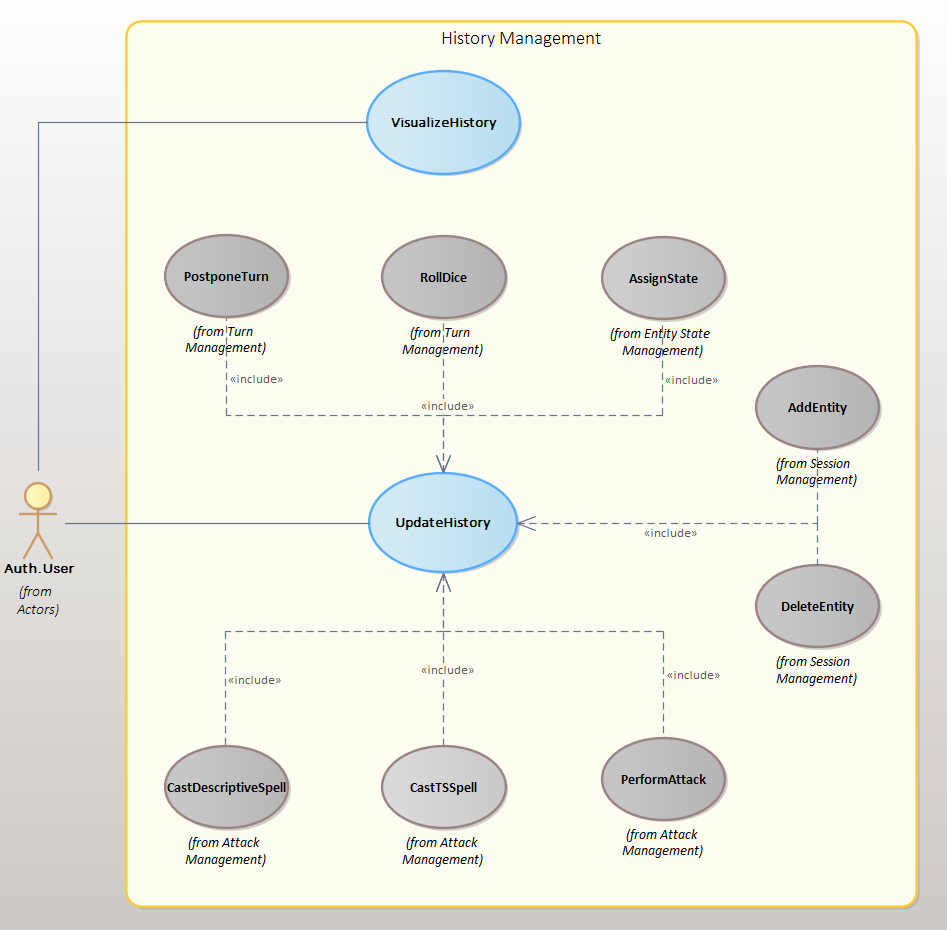
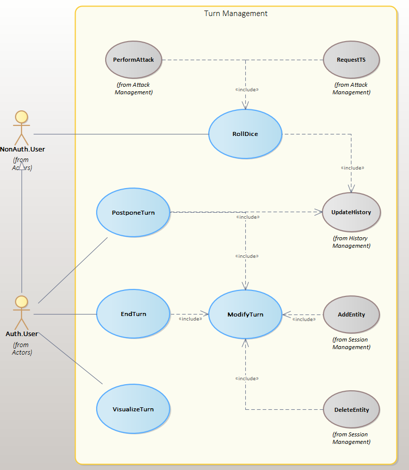

# Scheda DnD 5e Backend
## How to run
The API server

```docker build -t api .```

```docker run -it --rm -p 3000:3000 --name api01 API```

The websocket server

```ts-node websocket.ts```

// TODO: chiarire termini characters, allies, monsters e entity
// - : no param
// x : descrizioni da riempire
## UML diagrams






## App Routes

| Type | Route | Parameters | Description
| --- | --- | --- | --- |
| `GET` |` /sessions` | - | Returns all combact sessions for the user authenticated via JWT |
| `POST` |` /sessions` | characters, allies, monsters, mapSize | Creates a new combat session |
| `GET` |` /sessions/{sessionId}` | - | Returns all information on a combact session |
| `DELETE` |` /sessions/{sessionId}` | - | Deletes a combat session |
| `PATCH` |` /sessions/{sessionId}/start` | - | Starts a combat session |
| `PATCH` |` /sessions/{sessionId}/pause` | - | Pauses a combat session |
| `PATCH` |` /sessions/{sessionId}/continue` | - | Resumes a combat session |
| `PATCH` |` /sessions/{sessionId}/stop` | - | Ends a combat session |
| `PATCH` |` /sessions/{sessionId}/addEntity` | entityInfo | Adds a new entity to a fight |
| `GET` |` /sessions/{sessionId}/monsters/{monsterId}` | - | Returns a monster's info in a session |
| `POST` |` /sessions/{sessionId}/monsters` | monsterInfo | Adds a monster to a session |
| `DELETE` |` /sessions/{sessionId}/entity` | entityId | Removes an entity from a session |
|  |  |  |  |
| `GET` |` /diceRoll` | diceList, modifier | Roll dice |
| `GET` |` /sessions/{sessionId}/turn` | - | Returns the turn of a session |
| `GET` |` /sessions/{sessionId}/turn/postpone` | entityId, predecessorEntityId | Postpones an entity's turn |
| `GET` |` /sessions/{sessionId}/turn/end` | entityId | Ends the turn of an entity |
|  |  |  |  |
| `PATCH` |` /sessions/{sessionId}/attack` | attackInfo, attackerId, targetId | Makes one entity attack another |
| `GET` |` /sessions/{sessionId}/savingThrow` | entitiesId, difficultyClass, skill | Causes an entity to make a saving roll |
|  |  |  |  |
| `PATCH` |` /sessions/{sessionId}/addEffect` | entitiesId, effectType | Attaches an effect to an entity |
| `GET` |` /sessions/{sessionId}/{entityId}` | - | Returns entity info |
| `PATCH` |` /sessions/{sessionId}/{entityId}` | entityInfo | Modifies entity info |
| `GET` |` /sessions/{sessionId}/reaction` | entitiesId | Enables an entity's reaction |
|  |  |  |  |
| `GET` |` /sessions/{sessionId}/history` | - | Returns the battle history |
| `POST` |` /sessions/{sessionId}/history` | message | Adds a message to the battle history |
