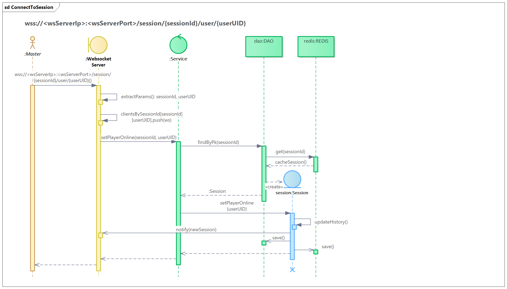

# Scheda DnD 5e Backend

// TODO: chiarire termini characters, allies, monsters e entity

## UML diagrams

### Actors
The player roles can be mapped as follows. Note that although the client must be authenticated via JWT to participate in the combat session, there is still a route that does not require authentication, namely the `diceRoll/` route.

### Session management

### Turn management

### Attack management

### Entity management

### History management

## App Routes

The API server endpoints are listed in the following table. Blank lines separate the routes following the semantic division of the previous use cases.

### Session Routes

| Type | Route | Parameters | Description |
| --- | --- | --- | --- |
| `GET` |` /sessions` | - | Returns all combact sessions for the user authenticated via JWT |
| `POST` |` /sessions` | characters, npc, monsters, mapSize | Creates a new combat session |
| `GET` |` /sessions/{sessionId}` | - | Returns all information on a combact session |
| `DELETE` |` /sessions/{sessionId}` | - | Deletes a combat session |
| `PATCH` |` /sessions/{sessionId}/start` | - | Starts a combat session |
| `PATCH` |` /sessions/{sessionId}/pause` | - | Pauses a combat session |
| `PATCH` |` /sessions/{sessionId}/continue` | - | Resumes a combat session |
| `PATCH` |` /sessions/{sessionId}/stop` | - | Ends a combat session |

### Entity Routes

| Type | Route | Parameters | Description |
| --- | --- | --- | --- |
| `PATCH` |` /sessions/{sessionId}/entity` | entityType, entityInfo | Adds a new entity to a fight |
| `GET` |` /sessions/{sessionId}/monsters/{monsterId}` | - | Returns a monster's info in a session |
| `DELETE` |` /sessions/{sessionId}/entity` | entityId | Removes an entity from a session |
| `GET` |` /sessions/{sessionId}/{entityId}` | - | Returns entity info |
| `PATCH` |` /sessions/{sessionId}/{entityId}` | entityInfo | Modifies entity info |

### Turn Routes

| Type | Route | Parameters | Description |
| --- | --- | --- | --- |
| `GET` |` /sessions/{sessionId}/turn` | - | Returns the turn of a session |
| `PATCH` |` /sessions/{sessionId}/turn/postpone` | entityId, predecessorEntityId | Postpones an entity's turn |
| `PATCH` |` /sessions/{sessionId}/turn/end` | entityId | Ends the turn of an entity |

### History Routes

| Type | Route | Parameters | Description |
| --- | --- | --- | --- |
| `GET` |` /sessions/{sessionId}/history` | - | Returns the battle history |
| `POST` |` /sessions/{sessionId}/history` | message | Adds a message to the battle history |

### Attack Routes

| Type | Route | Parameters | Description |
| --- | --- | --- | --- |
| `GET` |` /diceRoll` | diceList, modifier | Roll dice |
| `PATCH` |` /sessions/{sessionId}/attack` | attackInfo, attackerId, targetId | Makes one entity attack another |
| `GET` |` /sessions/{sessionId}/savingThrow` | entitiesId, difficultyClass, skill | Requests an entity to make a saving roll |
| `PATCH` |` /sessions/{sessionId}/effect` | entitiesId, effectType | Assign or remove an effect to an entity |
| `PATCH` |` /sessions/{sessionId}/reaction` | entitiesId | Enables entities reaction |

## Sequence diagrams

### Create Session

### Start Session

### Attack

### Enable Reaction

### Connect To Session

## Class diagram

