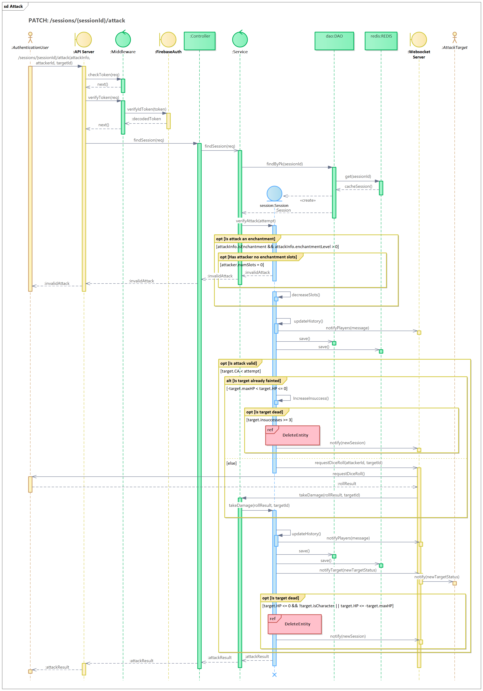

# Scheda DnD 5e Backend

######

// TODO: chiarire termini characters, allies, monsters e entity

## Use case diagram

### Actors
The player roles can be mapped as follows. Note that although the client must be authenticated via JWT to participate in the combat session, there is still a route that does not require authentication, namely the `diceRoll/` route.

### Session management

### Turn management

### Attack management

### Entity management

### History management

## App Routes

The API server endpoints are listed in the following table. Blank lines separate the routes following the semantic division of the previous use cases.

### Session Routes

| Type | Route | Parameters | Description |
| --- | --- | --- | --- |
| `GET` |`/sessions` | - | Provides the index of all sessions in which the authenticated user has the role of Player or Master. |
| `POST` |`/sessions` | characters, npc, monsters, mapSize | Creates a new session. The user must have a Master role. Returns the new session. |
| `GET` |`/sessions/{sessionId}` | - | Returns all information from `sessionId`. |
| `DELETE` |`/sessions/{sessionId}` | - | Deletes `sessionId`.|
| `PATCH` |`/sessions/{sessionId}/start` | - | Starts `sessionId`. Its current status must be `created`. |
| `PATCH` |`/sessions/{sessionId}/pause` | - | Pauses `sessionId`. Its current status must be `ongoing`. |
| `PATCH` |`/sessions/{sessionId}/continue` | - | Resumes `sessionId`. Its current status must be `paused`. |
| `PATCH` |`/sessions/{sessionId}/stop` | - | Ends `sessionId`. Its current status must be `ongoing` or `paused`. |

### Turn Routes

| Type | Route | Parameters | Description |
| --- | --- | --- | --- |
| `GET` |`/sessions/{sessionId}/turn` | - | Provides the current turn of `sessionId`. |
| `PATCH` |`/sessions/{sessionId}/turn/postpone` | entityId, predecessorEntityId | Postpones the turn of the `entityId` after the turn of the `predecessorEntityId`. |
| `PATCH` |`/sessions/{sessionId}/turn/end` | entityId | Ends the turn of the `entityId`. Notifies the next playing entity. |

### Attack Routes

| Type | Route | Parameters | Description |
| --- | --- | --- | --- |
| `GET` |`/diceRoll` | diceList, modifier | Rolls the dice in the `diceList` and adds up any `modifier`. The `diceList` must be non empty.  |
| `PATCH` |`/sessions/{sessionId}/attack` | attackInfo, attackerId, targetId | Causes `attackerId` to attack `targetId`. The attack may be melee or enchantment. The `attackInfo` must contain the attempt dice roll. If this is greater than the target's AC, the attacker is asked to roll the damage dice. |
| `GET` |`/sessions/{sessionId}/savingThrow` | entitiesId, difficultyClass, skill | Requests all the `entitiesId` to make a save roll on `skill`. The result is positive if greater than `difficultyClass`.|
| `PATCH` |`/sessions/{sessionId}/effect` | entitiesId, effect | Assigns the `effect` to all the `entitiesId`. If `effect` is null, the effects of the entities are deleted. |
| `PATCH` |`/sessions/{sessionId}/reaction` | entitiesId | Enables the reaction for all the `entitiesId`. Notifies them. |

### Entity Routes

| Type | Route | Parameters | Description |
| --- | --- | --- | --- |
| `PATCH` |`/sessions/{sessionId}/entities` | entityType, entityInfo | Adds an entity to the `sessionId`. If the `entityType` is monster, `entityInfo` must contain all of its information. Otherwise it must only contain the uid.  |
<!-- | `GET` |`/sessions/{sessionId}/monsters/{monsterId}` | - | Returns all the info from `monsterId`. | -->
| `DELETE` |`/sessions/{sessionId}/entities/{entityId}` | - | Removes `entityId` from `sessionId`. Fails if not found. |
| `GET` |`/sessions/{sessionId}/entities/{entityId}` | - | Returns all the info from `entityId`. Fails if not found in `sessionId`.|
| `PATCH` |`/sessions/{sessionId}/entities/{entityId}` | entityInfo | Updates the info of `entityId`. Fails if not found in `sessionId`. |

### History Routes

| Type | Route | Parameters | Description |
| --- | --- | --- | --- |
| `GET` |`/sessions/{sessionId}/history` | - | Returns the whole `sessionId` history. |
| `POST` |`/sessions/{sessionId}/history` | message | Adds a message to the `sessionId` history. Notifies all players except the one who posted the message. |

## Sequence diagram

### Create Session

### Start Session

### Attack

### Enable Reaction

### Connect To Session

## Class diagram

